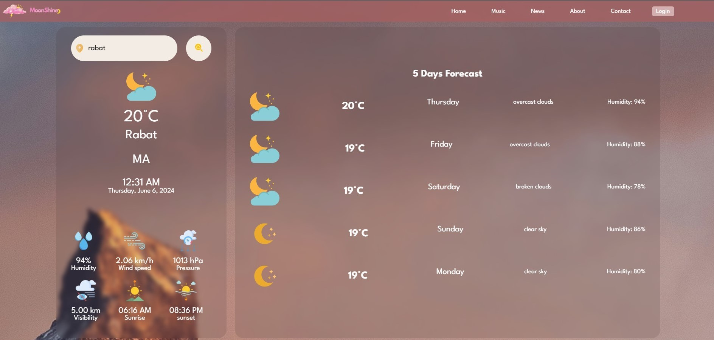
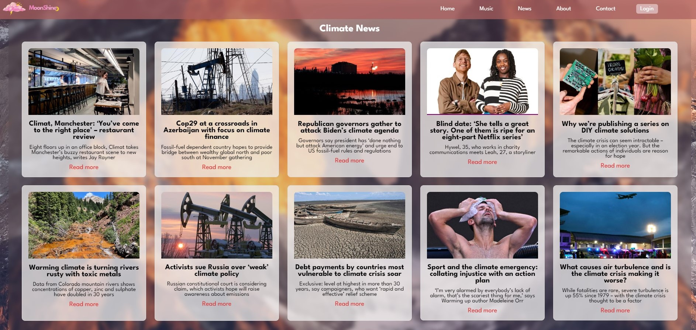
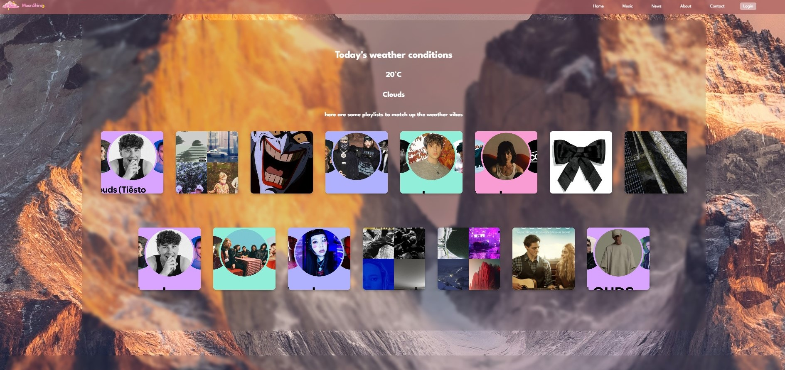

# Weather App and Music Portal

This project was developed as part of the ALX Foundation phase's "Build your portfolio project". It is a web application that serves as a one-stop for weather information, news, and music.

## Features

### Weather Information:
- Allows users to search for a city and displays the current weather conditions.
- Provides a 5-day weather forecast for the searched city.
- Dynamically generates a playlist based on the current weather conditions.

### Climate News:
- Fetches the latest climate-related news articles from the Guardian news API.
- Displays the news articles in a user-friendly format.

### Music:
- Fetches Spotify playlists depending on the current weather.
- Fetches new playlists whenever the search button is clicked.
- Displays the playlists in a user-friendly format.

## Technologies Used
- HTML
- CSS
- JavaScript
- OpenWeatherMap API
- Guardian News API
- Spotify API (for generating playlists)

## Getting Started

### Prerequisites
- You need to have a modern web browser installed.
- You will need API keys for OpenWeatherMap, Guardian News, and Spotify.

### Installation
1. Clone the repository:
    ```sh
    git clone https://github.com/yourusername/weather_app.git
    ```
2. Navigate to the project directory:
    ```sh
    cd weather_app
    ```
3. Open `index.html` in your web browser.

### Usage
1. Enter the city name in the search bar and click the search button.
2. The current weather, 5-day forecast, climate news, and music playlists will be displayed.

## API Configuration
1. Open `weather.js`, `news.js`, `spotify.js`  and replace the placeholders with your actual API keys:
    ```javascript
    const weatherApiKey = 'your_openweathermap_api_key';
    const newsApiKey = 'your_guardian_news_api_key';
    const spotifyApiKey = 'your_spotify_api_key';
    ```

## Screenshots




## Contributing
Contributions are welcome! Please fork the repository and create a pull request with your changes.

## License
This project is licensed under the MIT License.

## Contact
For any inquiries, please contact:
- Email: hmidouchnouhaila2@gmail.com
- GitHub: [Etsybt](https://github.com/Etsybt)

## Web Application

Web application deployed at: [https://etsybt.github.io/weather_app/](https://etsybt.github.io/weather_app/)
